# img2img-turbo

[**Paper**](https://arxiv.org/abs/2403.12036) | [**Sketch2Image Demo**](https://huggingface.co/spaces/gparmar/img2img-turbo-sketch)
#### **Quick start:** [**Running Locally**](#getting-started) | [**Gradio (locally hosted)**](#gradio-demo)

### Cat Sketching
<p align="left" >

</p>

### Fish Sketching
<p align="left">

</p>


We propose a general method for adapting a single-step diffusion model, such as SD-Turbo, to new tasks and domains through adversarial learning. This enables us to leverage the internal knowledge of pre-trained diffusion models while achieving efficient inference (e.g., for 512x512 images, 0.29 seconds on A6000 and 0.11 seconds on A100). 

Our one-step conditional models **CycleGAN-Turbo** and **pix2pix-turbo** can perform various image-to-image translation tasks for both unpaired and paired settings. CycleGAN-Turbo outperforms existing GAN-based and diffusion-based methods, while pix2pix-turbo is on par with recent works such as ControlNet for Sketch2Photo and Edge2Image, but with one-step inference. 

[One-Step Image Translation with Text-to-Image Models](https://arxiv.org/abs/2403.12036)<br>
[Gaurav Parmar](https://gauravparmar.com/), [Taesung Park](https://taesung.me/), [Srinivasa Narasimhan](https://www.cs.cmu.edu/~srinivas/), [Jun-Yan Zhu](https://github.com/junyanz/)<br>
CMU and Adobe, arXiv 2403.12036

<br>
<div>
<p align="center">
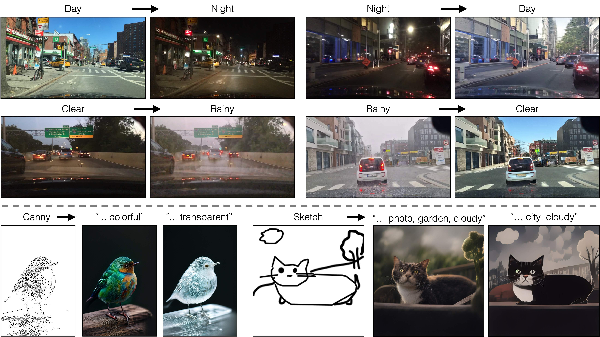
</p>
</div>


## Results

### Paired Translation with pix2pix-turbo
**Edge to Image**
<div>
<p align="center">
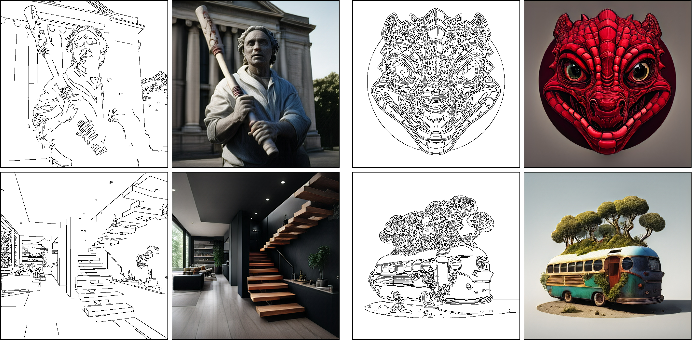
</p>
</div>

<!-- **Sketch to Image**
TODO -->
### Generating Diverse Outputs
By varying the input noise map, our method can generate diverse outputs from the same input conditioning.
The output style can be controlled by changing the text prompt.
<div> <p align="center">
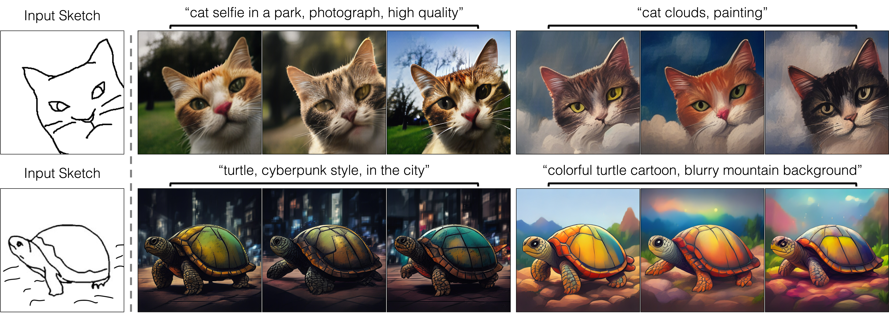
</p> </div>

### Unpaired Translation with CycleGAN-Turbo

**Day to Night**
<div> <p align="center">

</p> </div>

**Night to Day**
<div><p align="center">
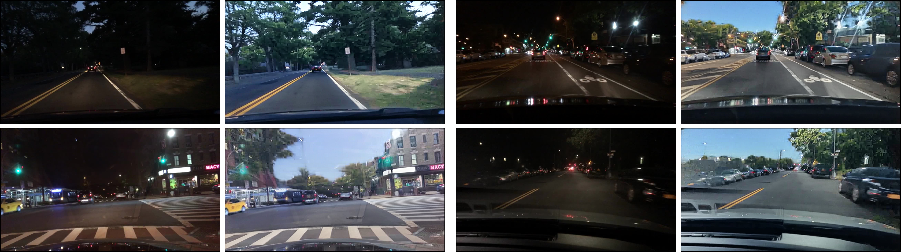
</p> </div>

**Clear to Rainy**
<div>
<p align="center">
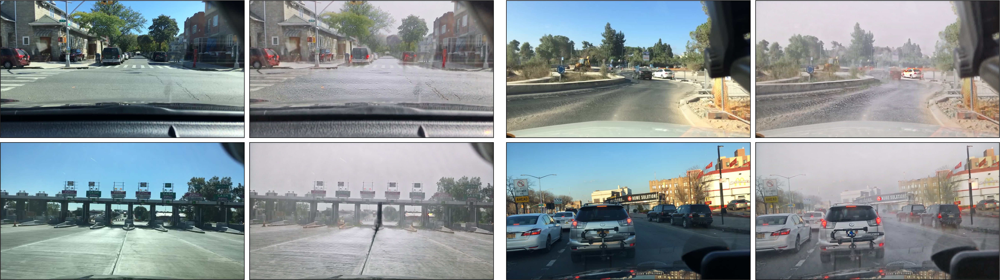
</p>
</div>

**Rainy to Clear**
<div>
<p align="center">
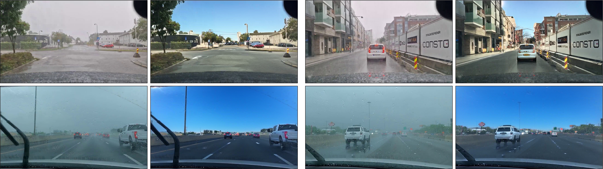
</p>
</div>
<hr>


## Method
**Our Generator Architecture:**
We tightly integrate three separate modules in the original latent diffusion models into a single end-to-end network with small trainable weights. This architecture allows us to translate the input image x to the output y, while retaining the input scene structure. We use LoRA adapters in each module, introduce skip connections and Zero-Convs between input and output, and retrain the first layer of the U-Net. Blue boxes indicate trainable layers. Semi-transparent layers are frozen. The same generator can be used for various GAN objectives.
<div>
<p align="center">
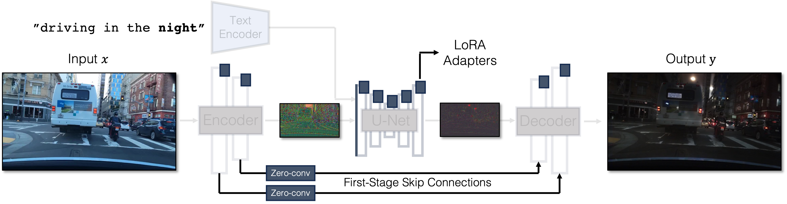
</p>
</div>


## Getting Started
**Environment Setup**
- We provide a [conda env file](environment.yml) that contains all the required dependencies.
    ```
    conda env create -f environment.yaml
    ```
- Following this, you can activate the conda environment with the command below. 
  ```
  conda activate img2img-turbo
  ```


**Paired Image Translation (pix2pix-turbo)**
- The following command takes an image file and a prompt as inputs, extracts the canny edges, and saves the results in the directory specified.
    ```bash
    python src/inference_paired.py --model_name "edge_to_image" \
        --input_image "assets/examples/bird.png" \
        --prompt "a blue bird" \
        --output_dir "outputs"
    ```
    <table>
    <th>Input Image</th>
    <th>Canny Edges</th>
    <th>Model Output</th>
    </tr>
    <tr>
    <td></td>
    <td>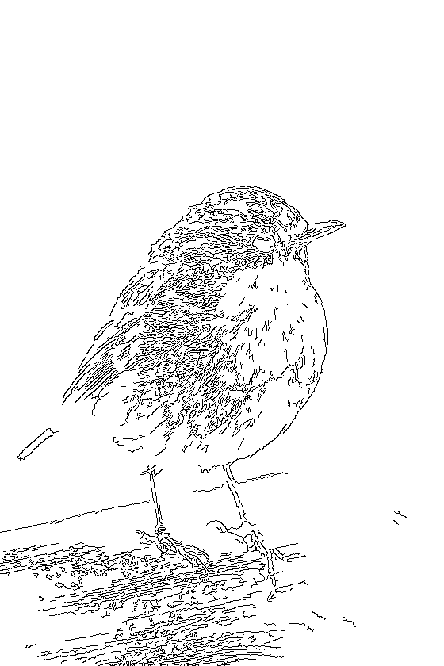</td>
    <td>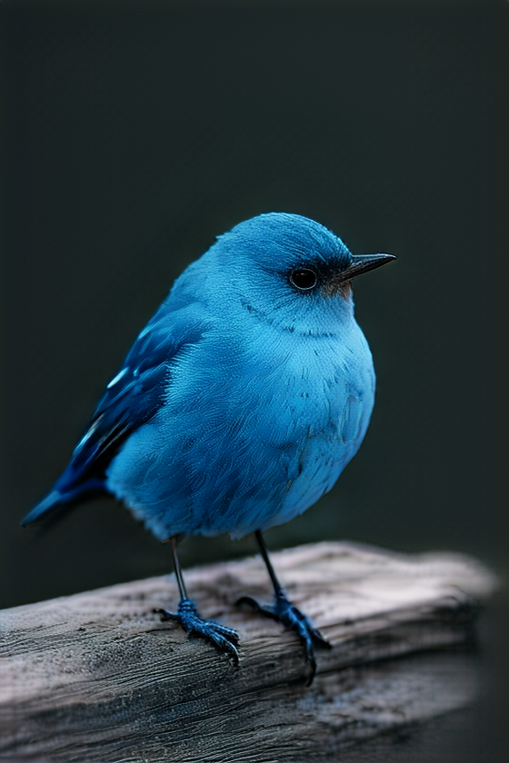</td>
    </tr>
    </table>
    <br>

- The following command takes a sketch and a prompt as inputs, and saves the results in the directory specified.
    ```bash
    python src/inference_paired.py --model_name "sketch_to_image_stochastic" \
    --input_image "assets/examples/sketch_input.png" --gamma 0.4 \
    --prompt "ethereal fantasy concept art of an asteroid. magnificent, celestial, ethereal, painterly, epic, majestic, magical, fantasy art, cover art, dreamy" \
    --output_dir "outputs"
    ```
    <table>
    <th>Input</th>
    <th>Model Output</th>
    </tr>
    <tr>
    <td>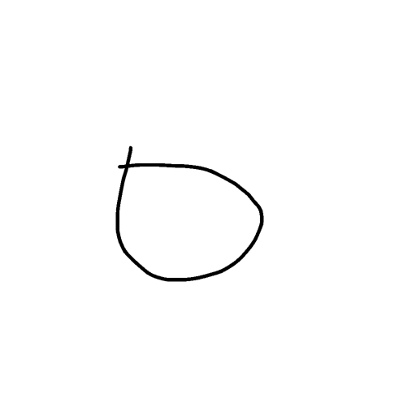</td>
    <td></td>
    </tr>
    </table>
    <br>

**Unpaired Image Translation (CycleGAN-Turbo)**
- The following command takes a **day** image file as input, and saves the output **night** in the directory specified.
    ```
    python src/inference_unpaired.py --model "day_to_night" \
        --input_image "assets/examples/day2night_input.png" --output_dir "outputs"
    ```
    <table>
    <th>Input (day)</th>
    <th>Model Output (night)</th>
    </tr>
    <tr>
    <td>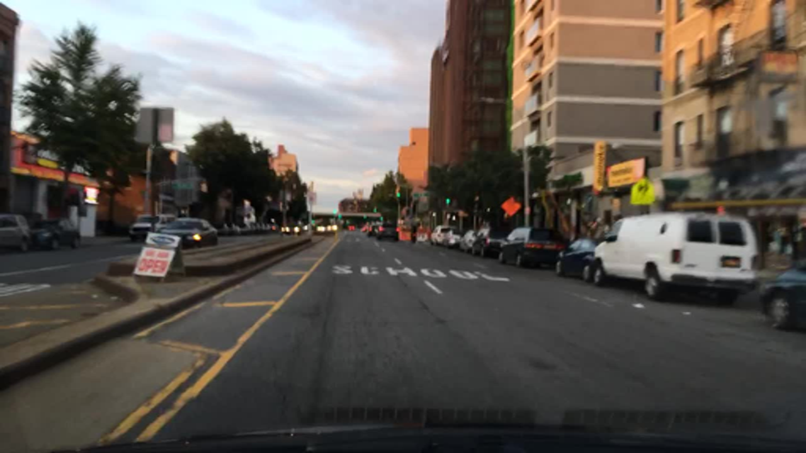</td>
    <td>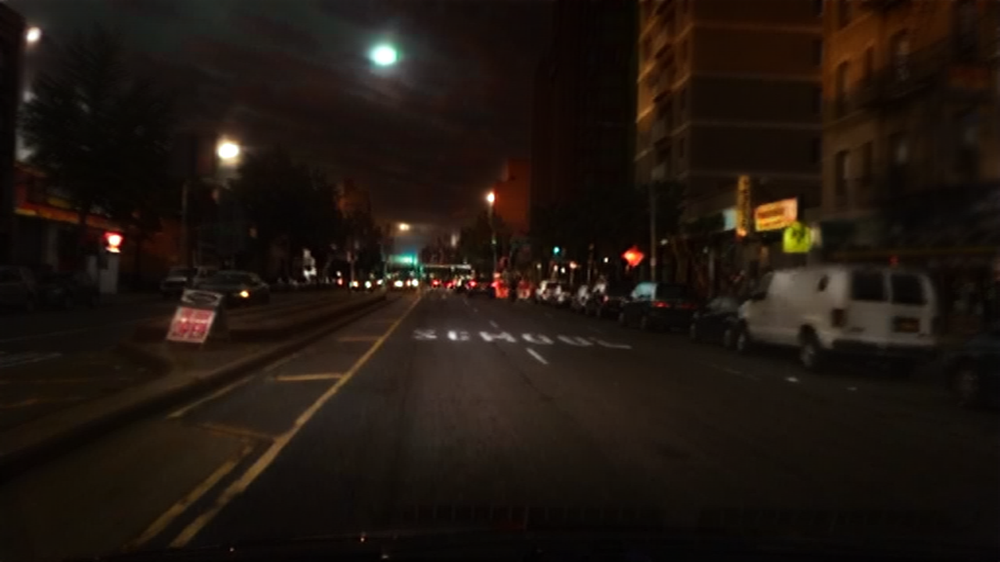</td>
    </tr>
    </table>

- The following command takes a **night** image file as input, and saves the output **day** in the directory specified.
    ```
    python src/inference_unpaired.py --model "night_to_day" \
        --input_image "assets/examples/night2day_input.png" --output_dir "outputs"
    ```
    <table>
    <th>Input (night)</th>
    <th>Model Output (day)</th>
    </tr>
    <tr>
    <td>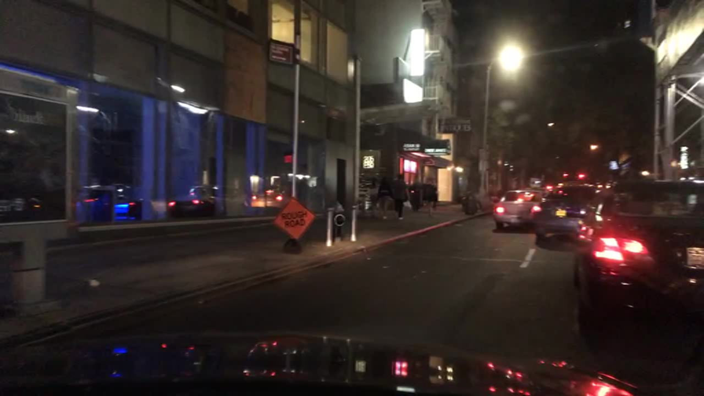</td>
    <td>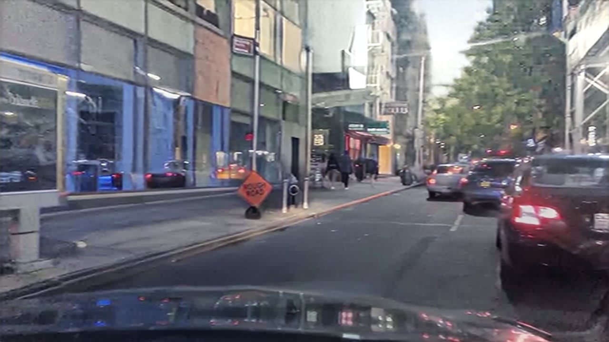</td>
    </tr>
    </table>

- The following command takes a **clear** image file as input, and saves the output **rainy** in the directory specified.
    ```
    python src/inference_unpaired.py --model "clear_to_rainy" \
        --input_image "assets/examples/clear2rainy_input.png" --output_dir "outputs"
    ```
    <table>
    <th>Input (clear)</th>
    <th>Model Output (rainy)</th>
    </tr>
    <tr>
    <td>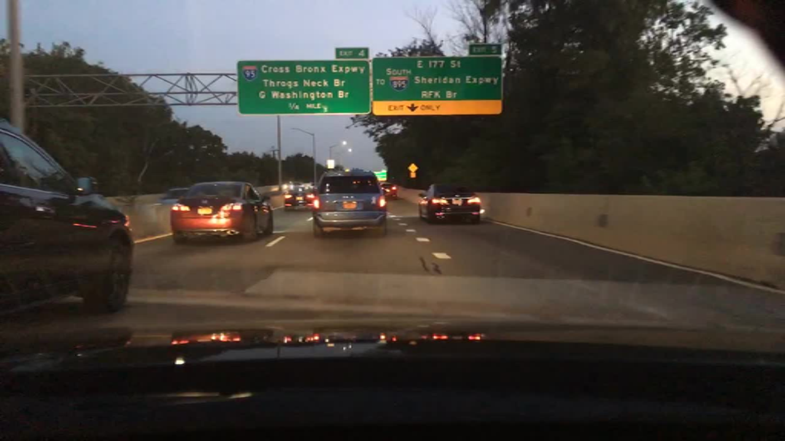</td>
    <td>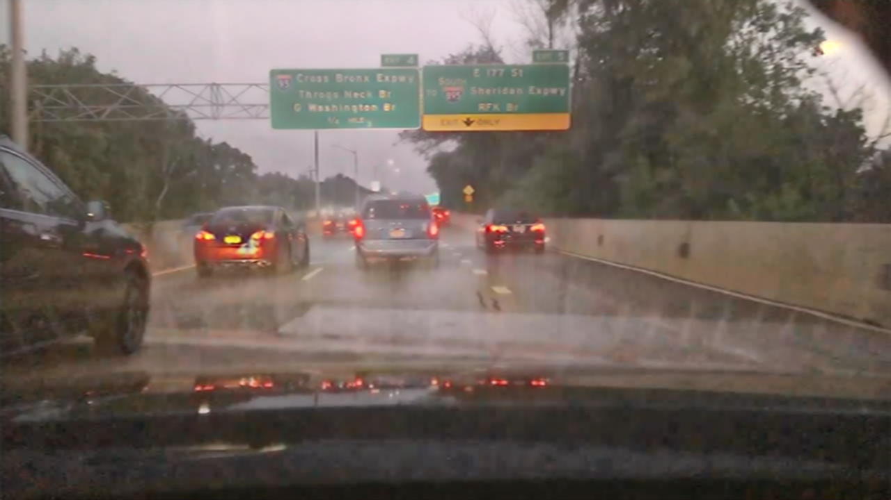</td>
    </tr>
    </table>

- The following command takes a **rainy** image file as input, and saves the output **clear** in the directory specified.
    ```
    python src/inference_unpaired.py --model "rainy_to_clear" \
        --input_image "assets/examples/rainy2clear_input.png" --output_dir "outputs"
    ```
    <table>
    <th>Input (rainy)</th>
    <th>Model Output (clear)</th>
    </tr>
    <tr>
    <td>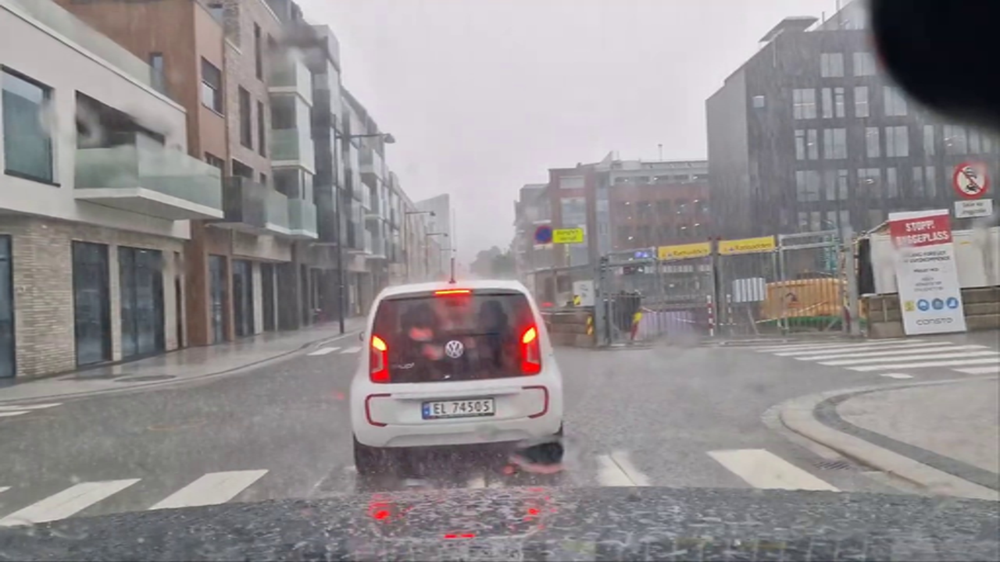</td>
    <td>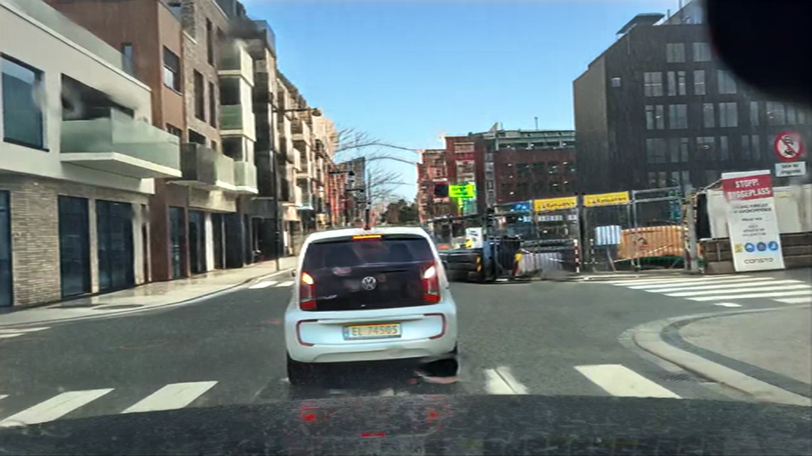</td>
    </tr>
    </table>


## Gradio Demo
- We provide a Gradio demo for the paired image translation tasks.
- The following command will launch the sketch to image locally using gradio.
    ```
    gradio gradio_sketch2image.py
    ```


## Acknowledgment
Our work uses the Stable Diffusion-Turbo as the base model with the following [LICENSE](https://huggingface.co/stabilityai/sd-turbo/blob/main/LICENSE).
