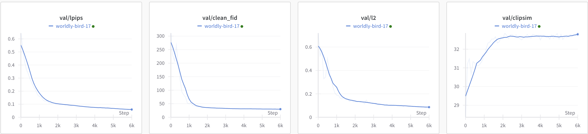
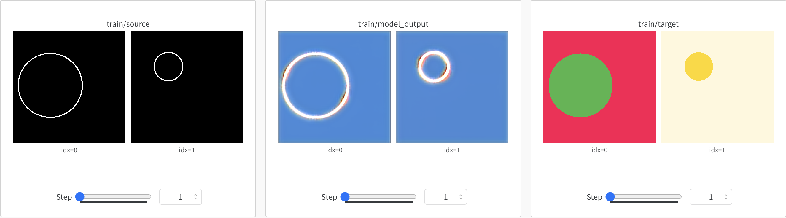
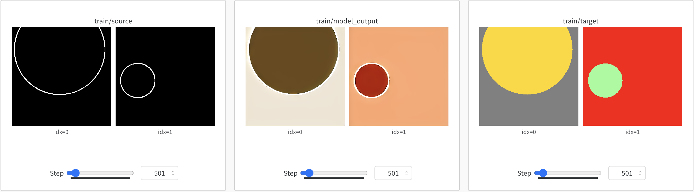
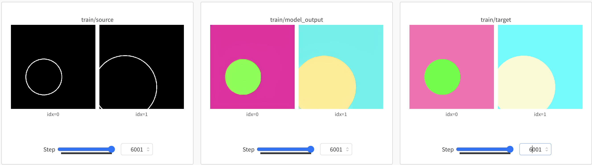

## Training with Paired Data (pix2pix-turbo)
Here, we show how to train a pix2pix-turbo model using paired data. 
We will use the [Fill50k dataset](https://github.com/lllyasviel/ControlNet/blob/main/docs/train.md) used by [ControlNet](https://github.com/lllyasviel/ControlNet) as an example dataset.


### Step 1. Get the Dataset
- First download a modified Fill50k dataset from [here](https://www.cs.cmu.edu/~img2img-turbo/data/my_fill50k.zip) using the command below.
    ```
    bash scripts/download_fill50k.sh
    ```

- Our training scripts expect the dataset to be in the following format:
    ```
    data
    ├── dataset_name
    │   ├── train_A
    │   │   ├── 000000.png
    │   │   ├── 000001.png
    │   │   └── ...
    │   ├── train_B
    │   │   ├── 000000.png
    │   │   ├── 000001.png
    │   │   └── ...
    │   └── train_prompts.json
    |
    |   ├── test_A
    │   │   ├── 000000.png
    │   │   ├── 000001.png
    │   │   └── ...
    │   ├── test_B
    │   │   ├── 000000.png
    │   │   ├── 000001.png
    │   │   └── ...
    │   └── test_prompts.json
    ```


### Step 2. Train the Model
- Initialize the `accelerate` environment with the following command:
    ```
    accelerate config
    ```

- Run the following command to train the model. 
    ```
    accelerate launch src/train_pix2pix_turbo.py \
        --pretrained_model_name_or_path="stabilityai/sd-turbo" \
        --output_dir="output/pix2pix_turbo/fill50k" \
        --dataset_folder="data/my_fill50k" \
        --resolution=512 \
        --train_batch_size=2 \
        --enable_xformers_memory_efficient_attention --viz_freq 25 \
        --track_val_fid \
        --report_to "wandb" --tracker_project_name "pix2pix_turbo_fill50k"
    ```

- Additional optional flags:
    - `--track_val_fid`: Track FID score on the validation set using the [Clean-FID](https://github.com/GaParmar/clean-fid) implementation.
    - `--enable_xformers_memory_efficient_attention`: Enable memory-efficient attention in the model.
    - `--viz_freq`: Frequency of visualizing the results during training.

### Step 3. Monitor the training progress
- You can monitor the training progress using the [Weights & Biases](https://wandb.ai/site) dashboard.

- The training script will visualizing the training batch, the training losses, and validation set L2, LPIPS, and FID scores (if specified).
    <div>
        <p align="center">
        
        </p>
    </div>


- The model checkpoints will be saved in the `<output_dir>/checkpoints` directory.

- Screenshots of the training progress are shown below:
    - Step 0:
    <div>
        <p align="center">
        
        </p>
    </div>
    
    - Step 500:
    <div>
        <p align="center">
        
        </p>
    </div>

    - Step 6000: 
    <div>
        <p align="center">
        
        </p>
    </div>


### Step 4. Running Inference with the trained models

- You can run inference using the trained model using the following command:
    ```
    python src/inference_paired.py --model_path "output/pix2pix_turbo/fill50k/checkpoints/model_6001.pkl" \
        --input_image "data/my_fill50k/test_A/40000.png" \
        --prompt "violet circle with orange background" \
        --output_dir "outputs"
    ```

- The above command should generate the following output:
    <table>
    <tr>
    <th>Model Input</th>
    <th>Model Output</th>
    </tr>
    <tr>
    <td></td>
    <td></td>
    </tr>
    </table>
